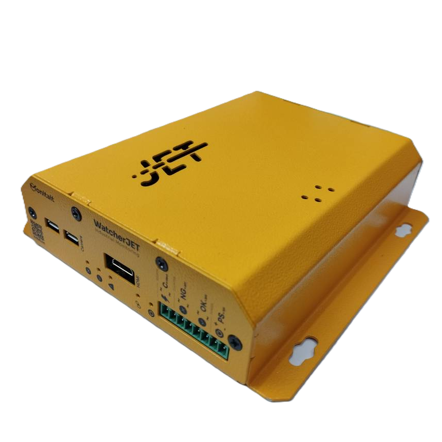

# Monitait Watcher Jet

Watcher Jet is an industrial Hardware to capture images and signals to use for monitoring and inspection manners, there are lots of applications which can be deployed by this without any concern about power, UPS, freeze, hand, shocks and etc.
we have been working on it whithin 4 years and try to make it as reliable as possible beside having security issues

# Getting started

- if you have purchased Jet from Monitait just add it in [Watchers](https://console.monitait.com/factory/watchers) via the prepared REGISTER KEY under the box

- if you want to build watcher by youself follow the instruction in [initilize documentation](docs/README.md)

- An external 12.6v 2A for `PS` (to recharfe the internal battries, a regulated power is needed, polarity is important) 
- An Access Point with a SSID like: `monitait` and a password like: `p@ssword`
- Connect the Signals:
- a bipolar 12-24V digital signal for `OK`
- a bipolar 12-24V digital signal for `NG`
- a 4-20mA analog signal for `C`
- a USB camera for `CAMERA`
- a mini HDMI for `HDMI`

## Add watcher in your Monitait account

there is a register id for each watcher, add the register id in monitait console [Watchers](https://console.monitait.com/factory/watchers) tab

## Test and Deploy

- by sending Signals you should see blue indicators blink
- if the counting reached half of acceptable threshold, the warning red indicator will be turn on (in case of low battery as well)
- if the link between watcher and the server established, the red chain inidactor blinks