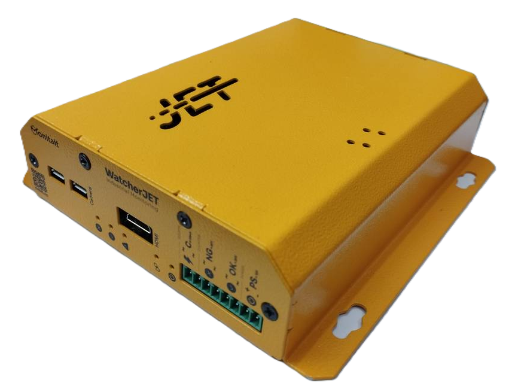

# Monitait Watcher Jet

Watcher Jet is a set of an Arduino, a RaspberryPi Zero W and some Electorinc components with an internal UPS, to make sure the whole hardware and software of an Industrial monitoring application will work seamlessly

## Getting started

What hardwares needed to run the watcher
- An external 12.6v 2A for `PS` (to recharfe the internal battries, a regulated power is needed)
- An Access Point with SSID: `monitait` and password: `1qaz!QAZ`
- a 12-24V digital signal for `OK`
- a 12-24V digital signal for `NG`
- a 4-20mA analog signal for `C`
- a USB camera for `CAMERA`
- a mini HDMI for `HDMI`

* the polarity only is important for PS

## Add watcher in your Monitait account

there is a register id for each watcher, add the register id in monitait console [Watchers](https://console.monitait.com/factory/watchers) tab

## Test and Deploy

- by sending Signals you should see blue indicators blink
- if the counting reached half of acceptable threshold, the warning red indicator will be turn on (in case of low battery as well)
- if the link between watcher and the server established, the red chain inidactor blinks