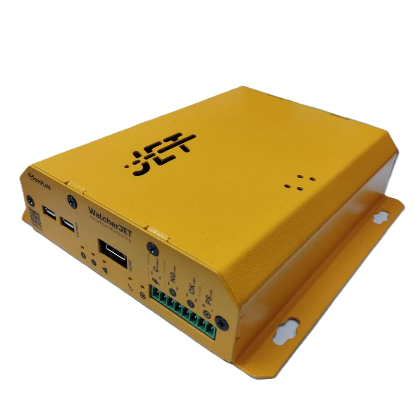

# Monitait Watcher Jet

Watcher Jet is a set of an Arduino, a RaspberryPi Zero W and some Electorinc components with an internal UPS, to make sure the whole hardware and software of an Industrial monitoring application will work seamlessly



## How to initaite the RPI

- Wathcer jet heart is to make collabration between Arduino and RPI to have better data consitency


- Order the PCB and the BOM of Watcher and solder all components on the board

- USE [Arduino IDE](https://www.arduino.cc/en/software) to upload the [jet-arduino](../jet-arduino/jet-arduino.ino) into the arduino board

- Install the [Raspberry Pi Imager](https://www.raspberrypi.com/software)

- Download and extract the [lite image](https://downloads.raspberrypi.com/raspios_lite_armhf/images/raspios_lite_armhf-2024-03-13/2024-03-12-raspios-bookworm-armhf-lite.img.xz)

- in the OS customisation Config page,set the name like `2024031501`(time + cronical number); set the user and password of rpi, the default user is `pi` and the default password is `raspberry`; the ssid and the password of the wireless network (i.e. `monitait` and `p@assword`) and in the SERVICES tab, enable the `SSH` (follow the instruction below)


- Put the SD card in the RPI and wait for the RPI finish the setup
- ssh into rpi

`ssh pi@2024031501`

```
sudo apt-get install git -y
cd ~
sudo git clone https://github.com/virasad/monitait_watcher_jet.git
bash /home/pi/monitait_watcher_jet/init/init.sh
sudo reboot now
```

What spare parts are needed to run on the watcher

- An SD card 
- An external 12.6v 2A for `PS` (to recharfe the internal battries, a regulated 12.6v power is needed)
- An Access Point with a SSID like: `monitait` and a password like: `p@ssword`
- a 12-24V digital signal for `OK`
- a 12-24V digital signal for `NG`
- a 4-20mA analog signal for `C`
- a USB camera for `CAMERA`
- a mini HDMI for `HDMI`

* the polarity only is important for PS


## Add watcher in your Monitait account

there is a register id for each watcher, add the register id in monitait console [Watchers](https://console.monitait.com/factory/watchers) tab


## Test and Deploy

- by sending Signals you should see blue indicators blink
- if the counting reached half of acceptable threshold, the warning red indicator will be turn on (in case of low battery as well)
- if the link between watcher and the server established, the link inidactor blinks